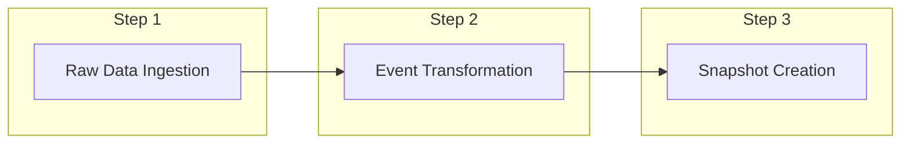
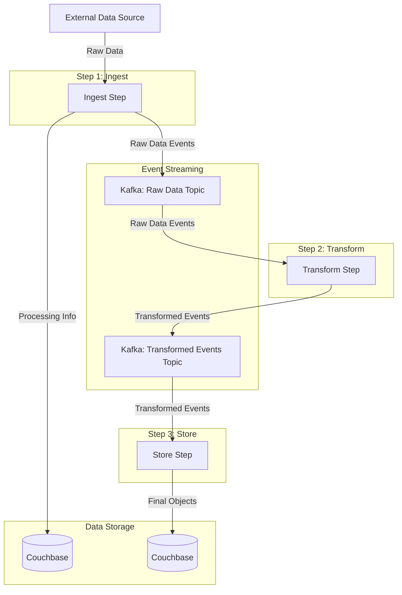
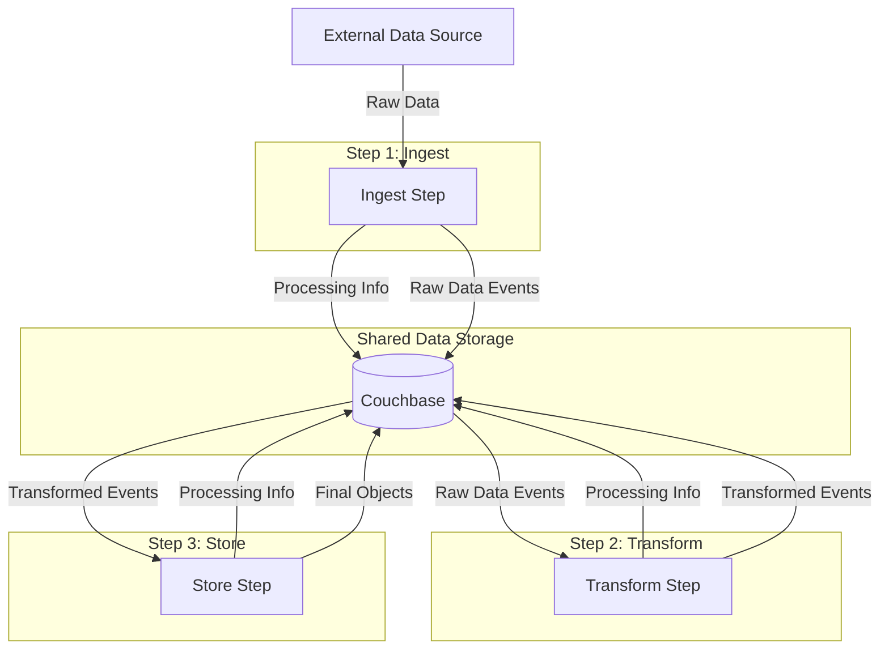
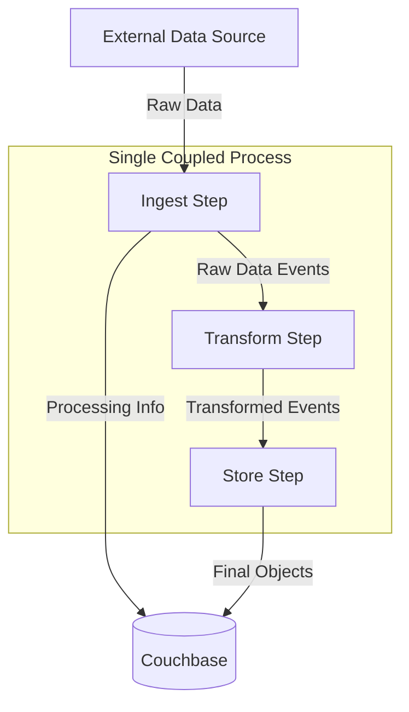

# 9. Vulnerability data ingestion process

Date: 2024-10-17

## Status

Accepted on 2024-10-17

Used by [0010-couchbase-as-database.md](0010-couchbase-as-database.md) on 2024-10-17 
 
Builds on [0004-event-driven.md](0004-event-driven.md) on 2024-10-17

## Context

Goal is to create a **Vulnerability and Advisory Information Processing** system that ingests, processes, and stores vulnerability and advisory information from various sources, allowing for flexible data usage and transformation.

### High-Level Flow

### Process Description

**Raw Data Ingestion:**
Collect vulnerability and advisory information from various sources. Store the raw data in its original format. Preserve all details for potential future reprocessing or analysis.

**Event Transformation**
Process the raw data and convert it into standardized events. Extract relevant information and structure it in a consistent format and then store the transformed events for further processing.

**Snapshot Creation**
Read the transformed events and create a comprehensive view of the vulnerability status at that moment.

## Implementation Options

This high-level design allows for flexibility in implementation, supporting the following three approaches:

**Option 1: High throughput, high scalability, and decoupled**

We decouple the three steps: ingest, transform, and store. This decoupling offers several advantages:

1. Flexibility: Each step can be run in the same or different environments as needed.
2. Efficiency: We avoid duplicate work by clearly separating the responsibilities of each step.
3. Scalability: Each step can be scaled independently based on its specific requirements.
4. Resilience: Failures in one step don't necessarily impact the others, improving overall system robustness.

This architecture allows for optimal resource allocation and easier maintenance, making it well-suited for handling large volumes of data and complex processing requirements.

**Option 2: High throughput, scalable but coupled to the same database source**

In this approach, the three steps (ingest, transform, and store) run separately but operate on data from a single, shared database source. This architecture offers a balance between performance and simplicity:

1. Partial Decoupling: Steps are logically separated, allowing for some independent scaling and management.
2. Simplified Data Management: Using a single database reduces complexity in data transfer and consistency management.
3. Moderate Scalability: While not as flexible as a fully decoupled system, this approach still allows for some level of independent scaling for each step.
4. Reduced Operational Complexity: Running all steps in the same environment simplifies deployment and monitoring.

This architecture is suitable for scenarios where high throughput and scalability are required, but the added complexity of a fully distributed system is not necessary or desired. It provides a good balance between performance and operational simplicity.

**Option 3: Low throughput, low scalability, and coupled**

In this approach, we integrate the three steps (ingest, transform, and store) into a single, sequential process within the same environment. This tightly coupled architecture offers several advantages:

1. Simplicity: The entire workflow runs as a single unit, simplifying development and debugging.
2. Reduced Overhead: No need for complex inter-process communication or data transfer between steps.
3. Ease of Development: Ideal for local development environments and rapid prototyping.
4. Resource Efficiency: Well-suited for scenarios with limited resources or single data sources.

This architecture is particularly useful for:
- Local development and testing
- Environments with only one data source

While this approach sacrifices scalability and high throughput capabilities, it provides a straightforward, easy-to-manage solution for simpler use cases or as a starting point for more complex implementations.

## Decision

We have decided to implement a hybrid approach combining elements of options 2 and 3:

1. We will use an abstraction layer in the code to decouple the implementation from specific database sources for the first two steps (Raw Data Ingestion and Event Transformation).

2. The steps will be designed to be general and flexible, allowing data to be passed between them in various ways, not tied to a particular database implementation.

3. For the final step (Snapshot Creation), we will maintain a tighter coupling to the database source. This decision is based on the potential complexity of data storage requirements (e.g., single objects, multiple objects, or complex relationships) which may vary depending on the specific use case.

This approach balances flexibility and simplicity, allowing for easier development and testing while maintaining the option to scale and optimize individual steps in the future if needed.

## Consequences

1. Flexibility: The abstraction layer allows for easier switching between different data sources or storage methods in the future.
2. Scalability: Individual steps can be optimized or scaled independently if needed.
3. Complexity: The hybrid approach introduces some additional complexity compared to a fully coupled system.
4. Development: Initial development may take longer due to the need for abstractions and more generalized code.
