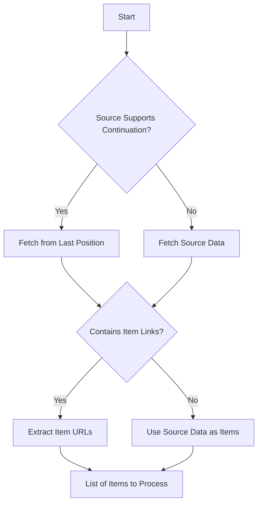
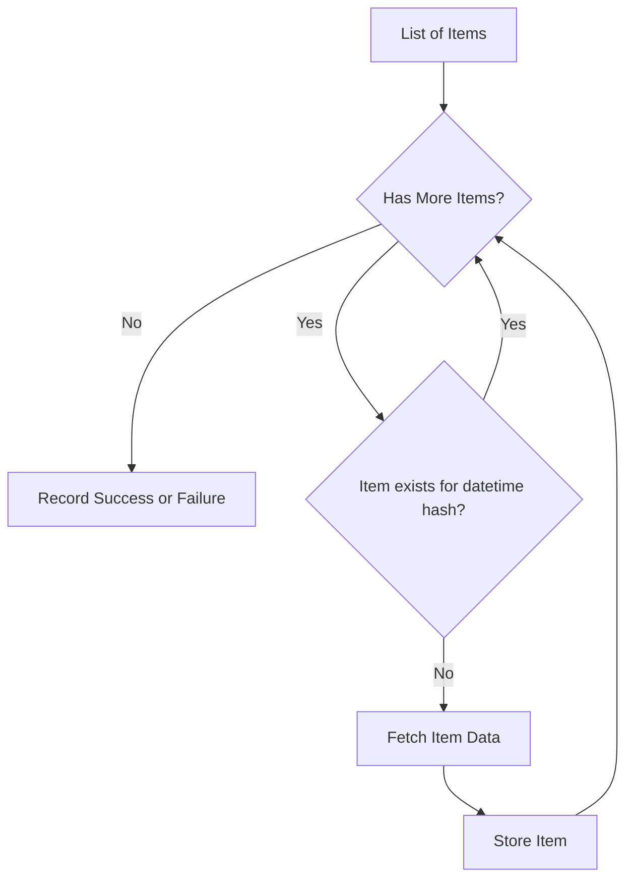
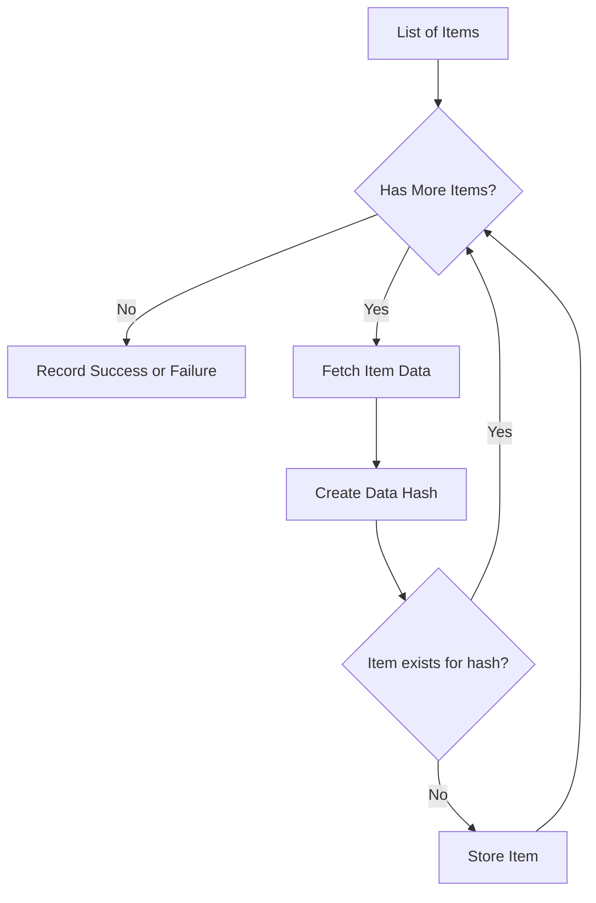

# Ingestion Process

## Fetching Raw Data

[Implementation details](../reference/vulsy/vulnerability_pipeline/ingestion/ingest/)

We retrieve the initial list from various sources. The following types of sources are recognized when fetching this initial list:

* **Endpoint with Pagination**: Allows specifying the index of the last fetched item so we can continue from where we left off.
* **Complete Feed Endpoint**: Provides all item links or a limited number of items based on date or size, we need to loop over all items.

Endpoints possess the following characteristics:

* They provide a response which contains links to actual items rather than the full data in the response. (Sometimes they also contain the full data while also linking to actual items)
    * This can be: JSON, HTML, XML, CSV, etc...
* They provide a response that does not link to actual items but includes them within the body of the response.

### The process

####Initial list fetching

####Processing Items time based

####Processing Items data based

